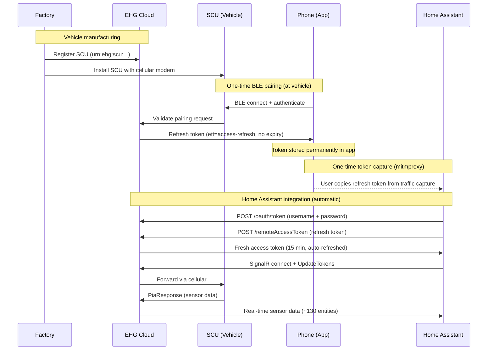
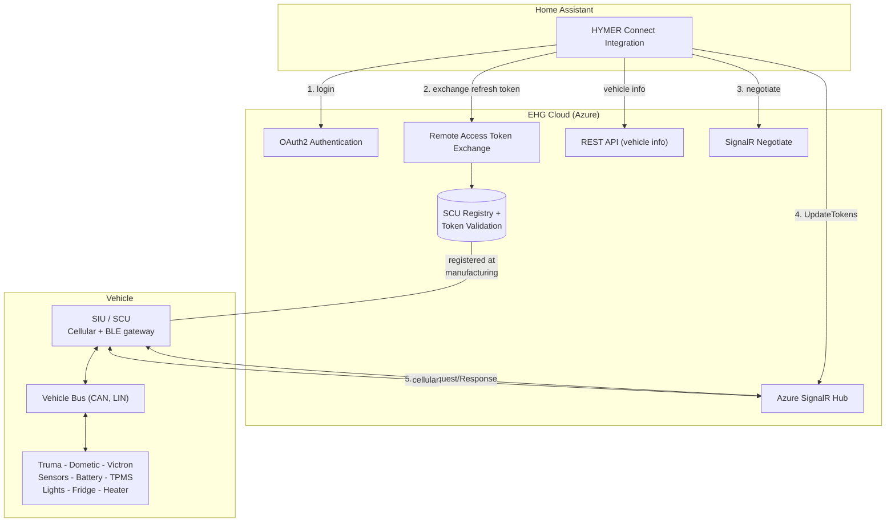
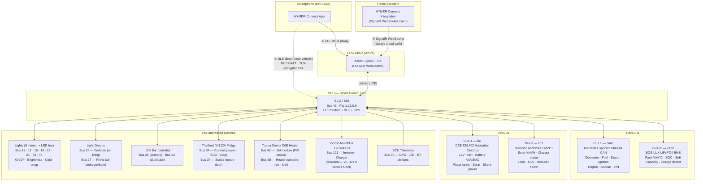

<p align="center">
  
</p>

# HYMER Connect for Home Assistant

[](https://github.com/hacs/integration)

[](https://my.home-assistant.io/redirect/hacs_repository/?owner=BetaHydri&repository=hymer-connect-ha&category=integration)

Custom integration to connect your HYMER / Erwin Hymer Group motorhome or caravan to [Home Assistant](https://www.home-assistant.io/).

Unlike the official EHG app, this integration gives you **full Home Assistant power** over your vehicle:

| | EHG App | HYMER Connect for HA |
|---|:---:|:---:|
| View sensor data (battery, GPS, temps, water) | ✅ | ✅ |
| Control lights, heater, fridge, boiler | ✅ | ✅ |
| 12V main switch on/off | ✅ | ✅ |
| **Automations & scripts** (e.g. turn off 12V at 10 PM) | ❌ | ✅ |
| **Energy dashboard** (solar kWh, battery history, voltage trends) | ❌ | ✅ |
| **Notifications** (door left open, battery low, SCU offline) | ❌ | ✅ |
| **History & statistics** (long-term sensor data) | ❌ | ✅ |
| **Custom dashboards** (desktop + mobile optimized) | ❌ | ✅ |
| **Combine with other HA devices** (home, weather, calendar) | ❌ | ✅ |
| **Template sensors** (corrected engine status, computed solar power) | ❌ | ✅ |
| **Always-on monitoring** (24/7, not just while app is open) | ❌ | ✅ |
| **~130 entities** (vs ~20 in the EHG app) | ❌ | ✅ |
| **SCU restart** (reboot the control unit remotely) | ✅ | ✅ |

> **⚠️ Important:** This integration **does not bundle any vendor secrets**. Before installing, capture two values from your own EHG-app traffic with `tools/Start-EhgTokenCapture.ps1` (Windows) or `tools/capture_ehg_token.py` (Linux/macOS):
>
> 1. **OAuth client header** — mandatory; required for every `/oauth/token` request.
> 2. **EHG Remote Access Refresh Token** — recommended; unlocks the ~130 real-time SignalR entities. Without it, only basic vehicle metadata (model, VIN, year) is available.
>
> See the [Prerequisites](custom_components/hymer_connect/README.md#prerequisites) and [Capturing the OAuth header and EHG refresh token](custom_components/hymer_connect/README.md#capturing-the-oauth-header-and-ehg-refresh-token) sections for the step-by-step guide.

> **v2.50.0** — **Per-entry OAuth client header is now mandatory** (the bundled fallback was removed). v2.49.0 users without a per-entry header will be guided through Home Assistant's standard reauth dialog after upgrading. See [CHANGELOG](CHANGELOG.md) for the breaking-change details and migration steps.

### Energy Dashboard

Monitor your motorhome's complete power flow at a glance — solar production, lithium battery state (SOC, SoH, voltage, temperature), habitation load draw, and charging status. All data comes directly from the vehicle's SCU via SignalR, updated every 60 seconds.

<p align="center">
  
</p>

> **Net Battery Flow vs Habitation Load:** The dashboard shows two current sensors that measure at different points in the electrical system. **Net Battery Flow** (`bms_current`, bus 99) is measured directly at the BOS LUX LiFePO4 cells — it shows the net result of all power sources minus all loads (positive = charging, negative = discharging). **Habitation Load** (`battery_current`, bus 3) is measured at the CBE EBL402 distribution board — it shows only what the habitation system consumes downstream.
>
> In the screenshot above (evening, no solar): Solar Production = 0W, Habitation Load = -0.38A (SCU, fridge ECU, and standby loads drawing from battery), Net Battery Flow = -0.26A (battery is discharging because there is no solar input to compensate). During daytime with solar active, Net Battery Flow would be positive (e.g. +1.6A) while Habitation Load stays negative — meaning solar is charging the battery despite the habitation draw.

### Dashboard Demo

<p align="center">
  
</p>

> 📺 [Watch the full video (MP4)](images/Hymer%20Connect%20Dashboard.mp4)

## Supported Brands

All Erwin Hymer Group brands equipped with a **Smart Interface Unit (SIU)**:

| Brand | | Brand |
|-------|-|-------|
| HYMER | | Carado |
| Buerstner | | Laika |
| Dethleffs | | Sunlight |
| Eriba | | FreeOnTour |
| LMC | | Niesmann+Bischoff |

## Features

### 🔌 Switch Controls

Control your vehicle's electrical systems from Home Assistant:

| Switch | Description | Protocol |
|--------|-------------|----------|
| **12V Main Switch** | Master 12V power on/off | bus 3, sid 1 — `str "On"/"Off"` |
| **Water Pump** | Water pump on/off | bus 3, sid 3 — `bool` |
| **Fridge ECO (Leise)** | Quiet mode overlay | bus 34, sid 2 — `bool` |

> **12V availability guard:** When the 12V main switch is off, all light entities and the water pump switch become **unavailable** in Home Assistant. Dashboard tile cards automatically gray them out and disable interaction, preventing commands to components that won't respond without habitation power. The fridge, boiler, heater, and the main switch itself remain controllable regardless of 12V state.

> **12V and passive sensors:** With 12V off, the SCU enters standby and stops pushing **passive sensor data** (door state, temperatures, water levels) to the cloud. Commands (fridge on/off, lights) still work because the SCU echoes command responses. The EHG app can still see passive sensor changes in standby because it connects via **BLE** directly to the SCU — Home Assistant only has the cloud/SignalR path. To see fridge door open/close events or heater window contact changes in HA, **12V must be ON**.

### 💡 Light Controls

Control 8 interior lights with on/off, brightness, and color temperature:

| Group | Lights | Features |
|-------|--------|----------|
| **Wohnen** (Living) | Ceiling, Ambient, Kitchen, Seating Overhead | On/Off, Brightness, Color Temp* |
| **Privat** (Private) | Bedroom Ambient, Night Light, Bathroom Ceiling, Bedroom Overhead | On/Off, Brightness, Color Temp* |

*Color temperature supported on Ambient and Kitchen lights.

The outside **LED bar** is controllable via `light.hymer` (bus 25) with on/off and brightness.

> **Native SCU light groups:** The integration also provides `light.hymer_wohnen_all_lights` (bus 24) and `light.hymer_privat_all_lights` (bus 27) — hardware group toggles that switch all Wohnen or Privat lights at once.

### 🌡️ Climate Controls

| Entity | Type | Description |
|--------|------|-------------|
| **Truma Heater** | Climate | Set target temperature, Heat/Off mode |
| **Heater Energy Source** | Select | Diesel / Both 900W / Both 1800W / Electric* |
| **Boiler Mode** | Select | Off / ECO / Turbo (HOT) |
| **Fridge Cooling Step** | Select | Off / 1 / 2 / 3 / 4 / 5 |

*Electric mode requires shore power (Landstrom). Without it, only Diesel and Both are available.

### ⛽ Fuel Consumption & Range (computed)

Three computed sensors derived from the CAN bus odometer and fuel level:

| Sensor | Entity ID | Description |
|--------|-----------|-------------|
| **Tank content** | `sensor.hymer_fuel_level_liters` | Fuel level in absolute liters |
| **Consumption** | `sensor.hymer_fuel_consumption` | Trip consumption in L/100km |
| **Estimated range** | `sensor.hymer_estimated_range` | Remaining range in km |

**How it works:**
- A trip reference point (odometer + fuel %) is stored on first reading
- Consumption is computed once ≥ 5 km have been driven
- Refueling is auto-detected when fuel level increases by > 5% — trip resets
- Tank capacity is configurable: **Settings > Integrations > HYMER Connect > Configure** (default: 93 L)
- Common Sprinter tanks: 71 L (314/316 CDI), 93 L (419/519 CDI standard)

### 📊 Real-Time Sensors (via SignalR, requires EHG Refresh Token)

| Category | Sensors |
|----------|---------|
| **Vehicle** | Odometer, fuel level, AdBlue level, engine hours, distance to service, outside temperature, ignition state, VIN, language, seatbelt warning |
| **Battery** | Voltage, current, SOC (%), chassis battery, charge phase, charger status, battery type, power source, shoreline connected |
| **BMS** | Pack voltage, current, temperature, SOC, SoH, capacity remaining, time remaining, charge detected, device failure |
| **Solar** | Voltage, current, power (W), panel connected, charger active |
| **Water** | Fresh water (EBL), grey water (EBL), water pump |
| **GPS** | Coordinates, altitude, heading, satellites, signal quality, fix status, UTC time |
| **Doors** | Driver, passenger (open/closed). Sliding/rear doors: CAN-bus only (Mercedes ME / mbapi2020) |
| **Security** | Lock status, ignition, handbrake, engine running, seatbelt warning |
| **Chassis** | Parking brake, aux heater available/state, cruise control, downhill assist, coolant warning, motor oil warning, wiping water empty |
| **Heating** | Truma connected/status/firmware, fan speed, fuel type, electric power (0/900/1800W), setpoint, operating mode |
| **Fridge** | Mode (cooling step), door status (binary sensor), ECO/Quiet mode, power on/off |
| **Fridge (Dometic)** | Mode (Silent/Performance/Turbo), cooling level (1–5), power source, compressor status, condenser fan, fridge type, warning codes — for vehicles with Dometic compressor fridges (e.g. Eriba Car 602) |
| **Lights** | 8 interior lights (on/off, brightness, color temp), LED bar (on/off, brightness), Wohnen group, Privat group |
| **Fuel** | Level (%), liters, consumption (L/100km), estimated range (computed) |
| **System** | SCU connected/firmware, Truma firmware, LTE connected, paired BT devices, SCU restart button |
| **Victron** | Inverter on/off, charger on/off, voltages, currents, frequencies, device failure, firmware (bus 121 — disabled by default, **non-functional**: Victron uses VE.Bus/RS-485 which is incompatible with the vehicle CAN bus) |
| **Total** | **~130 entities** (sensors, binary sensors, lights, switches, climate, selects) from CAN bus, LIN bus, GPS, and connected components |

### 🚐 Multi-Brand Notes (Eriba, Bürstner, Dethleffs, etc.)

The sensor map was built on a **HYMER Grand Canyon S 600 CrossOver** (Mercedes Sprinter, Thetford N4112A fridge, Truma Combi D6E). Other EHG brands share the same SCU and PIA protocol but may have different appliances on different buses.

**What works on all vehicles** (defined in `base.json`):
- Vehicle CAN: odometer, fuel, doors, ignition, engine status, chassis flags (bus 1)
- Habitation electrics: battery, water levels, main switch, charger, shore power (bus 3)
- GPS: coordinates, altitude, heading, satellites, signal (bus 30)
- SCU: connected status, firmware version (bus 45)

**What differs by vehicle model** (defined in brand overlays):
- **Fridge**: Thetford N4112A uses buses 34/37 (`hymer.json`), Dometic compressor uses bus 60 (`eriba.json`). The SCU only reports buses for hardware that's actually installed, so there's no conflict.
- **Lights**: The S600 light entities (bus 11/12/15/16/19/21/43/44) are defined in `hymer.json`. Eriba lights on different buses (bus 18 shower, bus 93 furniture) are in `eriba.json`. You can add or override light mappings in your brand's JSON overlay without changing any Python code.
- **Solar**: Voltronic MPP260CI (bus 8) is in `hymer.json`. Other solar chargers may use different bus IDs.
- **Heater**: Truma Combi D6E (buses 49/58) is in `hymer.json`. Vehicles with Truma Combi E (bus 6) or Alde need different mappings.
- **BMS**: BOS LUX LiFePO4 (bus 99) is in `hymer.json`.
- **Victron**: MultiPlus (bus 121) is in `hymer.json` but all entities disabled by default — VE.Bus hardware is non-functional via SCU.
- **Vehicle CAN bus (bus 1)**: Mercedes Sprinter vs VW Crafter may have different slot semantics for doors, ignition, and chassis flags. Brand overlays can override individual slots.

> **Eriba users** (v2.44.0+): Your `eriba.json` already defines Dometic fridge sensors (bus 60), **2 controllable light entities** (bus 18 shower ambient + bus 93 bedroom furniture), Truma Aventa AC placeholder slots (bus 59). With the JSON-driven architecture, you can **add sensors, lights, switches, and binary sensors yourself** without waiting for a release or writing Python code. See the [Self-Service Guide for Non-HYMER Brands](#-self-service-guide-for-non-hymer-brands-v2430) below.
>
> **🚀 Speed-up tip (v2.49.0+):** if you can run [@dan-simms1's metadata extractor](https://github.com/dan-simms1/hymer-connect-ha) against your own EHG APK once, you can pipe its output through [`tools/convert_dan_metadata.py`](tools/convert_dan_metadata.py) to **bootstrap a much more complete `eriba.json` in seconds** instead of mapping placeholder slots one at a time. Treat the generated file as a starting point and curate before opening a PR — see the [Bootstrap subsection](#-bootstrap-a-brand-overlay-with-toolsconvert_dan_metadatapy-v2490) for the two-step pipeline.

### � Dynamic Slot Discovery (v2.34.0+)

The integration's sensor map is loaded from JSON files in `sensor_maps/` (see `base.json` for shared definitions and `{brand}.json` for brand overlays). The base map was reverse-engineered on a HYMER Grand Canyon S 600 CrossOver. **All other EHG brands (Eriba, Bürstner, Dethleffs, LMC, Niesmann+Bischoff, Sunlight, Carado, Laika, FreeOnTour) share the same SCU hardware and PIA protobuf protocol**, but the slot layout can differ — different floor plans, different appliance models, different option packages can place sensors on bus/slot pairs that are not yet in the map.

To make every reported value visible regardless of brand or model, the integration now **automatically creates a generic diagnostic sensor for any `(bus_id, sensor_id)` pair the SCU reports that is not present in `SENSOR_MAP`**:

- **Entity name**: `Discovered bus N slot M`
- **Entity ID**: `sensor.hymer_discovered_bus{N}_slot_{M}`
- **Category**: Diagnostic
- **Disabled by default** — they will not appear in your dashboard unless you explicitly enable them in the entity registry

**To inspect unmapped slots on your vehicle:**

1. Go to **Settings → Devices & Services → HYMER Connect** → click the device
2. Scroll to **"+N entities not shown"** to see all disabled discovered entities
3. Click any entry → ⚙️ → enable it
4. Watch its raw value in **Developer Tools → States** while you trigger physical actions on the vehicle (toggle a light, open a door, switch on the heater) to identify what the slot reports

**Contributing your findings:**

If you identify what an unmapped slot does on your brand/model, please open an issue or PR adding the mapping to your brand's JSON sensor map overlay in `custom_components/hymer_connect/sensor_maps/` (e.g. `eriba.json`, `buerstner.json`). The base mappings shared across all brands live in `base.json`. Once added, the next release will replace the generic discovered entity with a properly named one with appropriate units and device class.

> **Existing entities are unaffected.** Discovered entities only ever cover slots that are *not* in `SENSOR_MAP` — there is no collision possible with the named sensors.

### 🛠️ Self-Service Guide for Non-HYMER Brands (v2.43.0+)

With the JSON-driven architecture, you can **add new sensors, rename slots, set icons, and create HA entities yourself** — no Python code, no waiting for a release. This is especially useful for Eriba, Bürstner, Dethleffs, and other EHG brands where the sensor bus layout differs from the S600.

#### 🚀 Bootstrap a brand overlay with `tools/convert_dan_metadata.py` (v2.49.0+)

If you don't want to start from a blank `sensor_maps/<brand>.json`, the repository ships [`tools/convert_dan_metadata.py`](tools/convert_dan_metadata.py) ([README](tools/README.md)) which can **generate a starting overlay** for your brand from a *local* EHG runtime-metadata extraction.

**Two-step pipeline** (you must do step 1 first):

1. **Generate the metadata extraction (upstream tool, run locally on your machine).** This converter only consumes the output — it does **not** extract anything from an APK itself. You must first run the upstream extractor that produces the required input files (`sensor_labels.json`, `component_kinds.json`, `control_catalog.json`, `coverage_audit.json`, optionally `support_matrix.json` / `vehicle_catalog.json`). The extractor is shipped as part of [**HYMER Connect Metadata Edition**](https://github.com/dan-simms1/hymer-connect-ha) by [@dan-simms1](https://github.com/dan-simms1) — see its `scripts/prepare_runtime_metadata.py` and `tools/README.md` for the exact procedure (you supply your own EHG APK; that data is never committed to either repo).

2. **Convert it to a brand overlay.** Once you have a local metadata directory from step 1:

   ```pwsh
   # Verify the converter on synthetic fixtures (no APK data needed)
   python tools\convert_dan_metadata.py self-test

   # Convert your local extraction
   python tools\convert_dan_metadata.py convert `
       --input  C:\path\to\your\local\metadata `
       --output custom_components\hymer_connect\sensor_maps\<brand>.json `
       --brand  <brand> `
       --vehicle-id <optional support_matrix key>
   ```

**Important caveats:**

- **Conservative emission** — the converter only auto-emits things it can identify with high confidence: read-only sensors and clearly-defined switches/lights. Climate/fridge/boiler/heater controls are deliberately **not** auto-generated; a `_climate_templates_required` marker block is written instead so you hand-port them from `sensor_maps/hymer.json` using the manual recipe in the next subsection.
- **Generated file is a starting point**, not a finished overlay — expect to rename auto-generated entity ids to match the conventions in [`base.json`](custom_components/hymer_connect/sensor_maps/base.json) / [`hymer.json`](custom_components/hymer_connect/sensor_maps/hymer.json), refine `device_class`/`icon` choices, and remove the `_generated_by` / `_source_vehicle_id` header keys before opening a PR. Test on a real vehicle first.
- **Nothing APK-derived gets committed** — the input metadata directory and `oauth_client.json` are blocked by `.gitignore`; only the curated overlay JSON should land in a PR.

If you prefer to start completely from scratch (no upstream extractor, no APK), the manual recipe below is fully self-contained and equally valid.

#### What you can do yourself

| Task | How | Example |
|------|-----|---------|
| **Name a discovered slot** | Add a decode-only entry to your brand's `"sensors"` | `"18,1": {"name": "light_shower_ambient"}` |
| **Create a sensor entity** | Add `"platform": "sensor"` + metadata | `"59,3": {"name": "ac_temperature", "unit": "°C", "platform": "sensor", "device_class": "temperature", "icon": "mdi:thermometer"}` |
| **Create a binary sensor** | Add `"platform": "binary_sensor"` + metadata | `"60,8": {"name": "dometic_fridge_power", "platform": "binary_sensor", "device_class": "power", "icon": "mdi:fridge"}` |
| **Add a light** | Add entry to `"lights"` keyed by bus_id | `"18": {"name": "light_shower_ambient", "icon": "mdi:shower-head", "brightness": true, "color_temp": false}` |
| **Add a switch** | Add entry to `"switches"` keyed by `"bus,slot"` | `"34,2": {"name": "fridge_eco_ctrl", "icon": "mdi:leaf", "write_type": "bool", "on_value": true, "read_path": "signalr_sensors.fridge_eco"}` |
| **Override a base entry** | Use the same key in your brand file | Your brand file wins over `base.json` for that slot |
| **Disable an entity by default** | Add `"enabled": false` | `"121,1": {"name": "victron_inverter_on", ..., "enabled": false}` |

#### Step-by-step: Adding a new sensor for your vehicle

**Example:** You discovered that bus 59, slot 3 reports your Truma Aventa AC's target temperature.

1. **Edit your brand's JSON file** — e.g. `custom_components/hymer_connect/sensor_maps/eriba.json`:

   ```json
   "59,3": {
     "name": "ac_aventa_target_temp",
     "unit": "°C",
     "platform": "sensor",
     "device_class": "temperature",
     "state_class": "measurement",
     "icon": "mdi:air-conditioner"
   }
   ```

2. **Add a translation** in `custom_components/hymer_connect/translations/en.json`:

   ```json
   "sensor": {
     ...
     "ac_aventa_target_temp": { "name": "AC target temperature" }
   }
   ```

3. **Restart Home Assistant** — the integration reloads the JSON at startup and creates the entity automatically.

4. **Verify** — go to **Developer Tools → States** and search for your new entity. It should show the raw value from the SCU.

5. **Contribute** — open a PR with your changes so other Eriba users benefit too!

#### Step-by-step: Adding a light for your vehicle (v2.44.0+)

**Example:** Your Eriba has a shower ambient light on bus 18.

1. **Ensure the sensor decode entries exist** in `"sensors"` (bus 18, sid 1 = on/off, sid 2 = brightness):
   ```json
   "18,1": {"name": "light_shower_ambient"},
   "18,2": {"name": "light_shower_ambient_brightness", "unit": "%"}
   ```

2. **Add a light entry** in the `"lights"` section:
   ```json
   "lights": {
     "18": {
       "name": "light_shower_ambient",
       "icon": "mdi:shower-head",
       "brightness": true,
       "color_temp": false
     }
   }
   ```

3. **Add a translation** in `translations/en.json`:
   ```json
   "light": {
     "light_shower_ambient": { "name": "Shower ambient" }
   }
   ```

4. **Restart HA** — the light entity appears with on/off and brightness slider.

**Light convention:** All EHG lights use the same SCU protocol: sid 1 = on/off (bool), sid 2 = brightness (uint 0–100%), sid 3 = color_temp (uint 0–100%). Set `"color_temp": true` only if the light supports it.

#### Step-by-step: Adding a switch for your vehicle (v2.44.0+)

**Example:** You want to add a fridge ECO switch on bus 34, slot 2.

1. **Ensure the sensor decode entry exists** in `"sensors"`:
   ```json
   "34,2": {"name": "fridge_eco"}
   ```

2. **Add a switch entry** in the `"switches"` section:
   ```json
   "switches": {
     "34,2": {
       "name": "fridge_eco_ctrl",
       "icon": "mdi:leaf",
       "write_type": "bool",
       "on_value": true,
       "read_path": "signalr_sensors.fridge_eco"
     }
   }
   ```

3. **Add a translation** in `translations/en.json`:
   ```json
   "switch": {
     "fridge_eco_ctrl": { "name": "Fridge ECO" }
   }
   ```

4. **Restart HA** — the switch entity appears.

**Switch fields:**
| Field | Required | Description |
|-------|----------|-------------|
| `name` | Yes | Entity key and translation key |
| `write_type` | Yes | `"bool"`, `"str"`, or `"uint"` — how the PIA command is sent |
| `on_value` | Yes | Readback value that means ON (e.g. `true`, `"On"`, `1`) |
| `read_path` | Yes | Coordinator data path to read current state |
| `icon` | No | MDI icon |
| `write_on` / `write_off` | No | For `"str"` switches — the string values sent for ON/OFF (defaults: `"On"`/`"Off"`) |
| `holdoff_off` | No | Seconds to hold optimistic OFF state after commanding OFF (default: 15). Use 30 for 12V main switch to ride through SCU bounce-back. |
| `requires_12v` | No | `true` = entity unavailable when 12V main is off (e.g. water pump) |

#### Step-by-step: Adding climate/heater/fridge controls for your vehicle (v2.45.0+)

The `"climate"` section in your brand JSON defines which bus and slot IDs the heater, boiler, and fridge use. The Python write logic (multi-step sequences, paired writes, delays) stays the same — only the bus/slot addresses come from JSON.

**How the Truma heater controls work on the wire:**

The Truma Combi heater uses multiple slots on the same bus that must be written together:

```
Bus 58 (Truma Combi D6E on S600/S700):
├── sid 4: heater_fuel_type      "Diesel" / "Both" / "Electric"  (rw, str)
├── sid 5: water_heater_mode     "OFF" / "ECO" / "HOT"           (rw, str) ← boiler
├── sid 6: heater_fuel_type_2    mirrors sid 4, always paired     (rw, str)
├── sid 8: heater_setpoint       float °C, -273.0 = OFF          (rw, float) ← climate
└── sid 9: electric_power        900 / 1800                      (rw, uint) ← wattage
```

When you turn the heater on, the integration sends setpoint (sid 8) + fuel_type_2 (sid 6) as a paired multi-sensor command. When you change the boiler mode, it sends boiler_mode (sid 5) + fuel_type (sid 4) together. This pairing is required by the SCU.

**JSON `"climate"` section (from `hymer.json`):**

```json
"climate": {
  "truma_heater": {
    "heater_bus": 58,
    "setpoint_sid": 8,
    "fuel_type_sid": 4,
    "fuel_type_2_sid": 6,
    "boiler_sid": 5,
    "electric_power_sid": 9,
    "temp_sensor": "ambient_temp",
    "setpoint_sensor": "heater_setpoint",
    "fuel_type_sensor": "heater_fuel_type",
    "boiler_sensor": "heater_fan_speed",
    "electric_power_sensor": "heater_electric_power"
  },
  "fridge": {
    "type": "thetford_t2000",
    "control_bus": 34,
    "power_sid": 1,
    "cooling_step_sid": 3,
    "power_sensor": "fridge_power",
    "cooling_step_sensor": "fridge_cooling_step",
    "mode_sensor": "fridge_mode"
  }
}
```

**What this creates in HA:**
- `climate.hymer_truma_heater` — HEAT/OFF + target temperature slider
- `select.hymer_fridge_mode_ctrl` — Off / 1 / 2 / 3 / 4 / 5
- `select.hymer_boiler_mode_ctrl` — Off / ECO / Turbo
- `select.hymer_heater_energy_ctrl` — Diesel / Mix 900W / Mix 1800W / Electric 900W / Electric 1800W

**Climate fields reference:**

| Field | Used by | Description |
|-------|---------|-------------|
| `heater_bus` | climate + boiler + energy | Bus ID for the heater (e.g. 58 for Truma D6E, 6 for Truma Combi E) |
| `setpoint_sid` | climate | Slot for target temperature (float write) |
| `fuel_type_sid` | boiler + energy | Slot for fuel type string ("Diesel"/"Both"/"Electric") |
| `fuel_type_2_sid` | climate + energy | Mirror slot — always paired with fuel_type_sid |
| `boiler_sid` | boiler | Slot for boiler mode string ("OFF"/"ECO"/"HOT") |
| `electric_power_sid` | energy | Slot for electric power wattage (uint 900/1800) |
| `temp_sensor` | climate | Sensor name to read current temperature from |
| `setpoint_sensor` | climate | Sensor name to read current setpoint from |
| `fuel_type_sensor` | climate + boiler + energy | Sensor name to read current fuel type from |
| `boiler_sensor` | boiler | Sensor name to read current boiler mode from |
| `electric_power_sensor` | energy | Sensor name to read current wattage from |

**Fridge fields reference:**

| Field | Description |
|-------|-------------|
| `control_bus` | Bus ID for fridge control (34 for Thetford, 60 for Dometic) |
| `power_sid` | Slot for power on/off (bool write) |
| `cooling_step_sid` | Slot for cooling step 1–5 (uint write) |
| `power_sensor` | Sensor name to read power state from |
| `cooling_step_sensor` | Sensor name to read cooling step from |
| `mode_sensor` | Sensor name to read operating mode from |

**For other brands:** If your vehicle has a different heater (e.g. Truma Combi E on bus 6, or Alde on another bus), add the `"climate"` section to your brand JSON with the correct bus/slot IDs. The write commands use the same PIA protocol — only the addresses differ. If no `"climate"` section exists, the climate and select entities are simply not created.

#### Step-by-step: From converted JSON to a working brand overlay (non-S600/S700)

This is the end-to-end recipe if your vehicle is **not** a HYMER Grand Canyon S 600/S 700 and `hymer.json` does not match. It walks you from the raw output of `tools/convert_dan_metadata.py` (or an empty brand file) to a curated overlay you can submit as a PR — and tells you exactly when to stop and open an issue instead.

##### 0. Prerequisites

- Integration installed and running against your vehicle.
- (Recommended) A converter-generated `sensor_maps/<brand>.json` from the [Bootstrap subsection](#-bootstrap-a-brand-overlay-with-toolsconvert_dan_metadatapy-v2490). If you don't have one, start from an empty `{ "sensors": {}, "lights": {}, "switches": {}, "climate": {} }`.
- Debug logging enabled for the PIA decoder:
  ```yaml
  logger:
    logs:
      custom_components.hymer_connect.pia_decoder: debug
  ```
- Vehicle 12V on (so passive sensors push data over SignalR).

##### 1. Triage the converter output

Open your `<brand>.json` next to [`hymer.json`](custom_components/hymer_connect/sensor_maps/hymer.json) and check three things:

1. **Headers** — remove `_generated_by` / `_source_vehicle_id`; keep `_comment`, `_doc`, `_vehicles`.
2. **`_climate_templates_required` marker** — the converter writes this instead of guessing climate/fridge/heater/boiler. You will fill it in by hand in steps 5–6.
3. **Auto-emitted sensors** — these are conservatively typed read-only entries. Most are correct; some need renaming to canonical conventions (see step 3).

##### 2. Identify your fridge bus

Run the EHG app, then in HA's **Settings → Devices → HYMER Connect → "+N entities not shown"** look at the **Discovered slot** diagnostic entities (or grep the HA log for `Discovered unmapped slot`).

| Action in the EHG app | Slot that changes value | Field it maps to |
|---|---|---|
| Toggle fridge **on/off** | bool, flips 0↔1 | `power_sid` |
| Change cooling step **1 → 5** | uint, follows the step | `cooling_step_sid` |
| Toggle ECO | bool | (becomes a `switches` entry, not climate) |
| Just observe — operating mode/status | enum string ("Off"/"On"/"ECO" …) | `mode_sensor` source slot |

The bus that hosts these slots is your `control_bus`. On S600 it is `34` (Thetford T2000); on Eriba 602 it is `60` (Dometic). If your three control slots all sit on a bus you don't recognize, write that bus number down — you will need it for step 7.

##### 3. Name the slots in `"sensors"`

For every slot you identified, add or rename the entry in `"sensors"` so the names match what the climate/select code expects to read back:

```json
"sensors": {
  "<bus>,<power_sid>":        {"name": "fridge_power"},
  "<bus>,<cooling_step_sid>": {"name": "fridge_cooling_step"},
  "<bus>,<mode_slot>":        {"name": "fridge_mode", "platform": "sensor", "icon": "mdi:fridge"}
}
```

The `name:` strings (`fridge_power`, `fridge_cooling_step`, `fridge_mode`) are the canonical readback keys consumed by the `"climate"` block in step 5 — keep them exactly as written.

##### 4. (Optional) Add the ECO switch

If your fridge has an ECO toggle on the same bus, add it to `"switches"` (this is independent of the climate block):

```json
"switches": {
  "<bus>,<eco_sid>": {
    "name": "fridge_eco_ctrl",
    "icon": "mdi:leaf",
    "write_type": "bool",
    "on_value": true,
    "read_path": "signalr_sensors.fridge_eco"
  }
}
```

Make sure `"sensors"."<bus>,<eco_sid>"` has `"name": "fridge_eco"` so `read_path` resolves.

##### 5. Wire up the `"climate"` block

For a **Thetford-style absorber** (most HYMER/Bürstner/Carado/Dethleffs caravans) the S600 logic in `select.py` works as-is — only the addresses change:

```json
"climate": {
  "fridge": {
    "type": "thetford_t2000",
    "control_bus": <bus from step 2>,
    "power_sid": <slot from step 2>,
    "cooling_step_sid": <slot from step 2>,
    "power_sensor": "fridge_power",
    "cooling_step_sensor": "fridge_cooling_step",
    "mode_sensor": "fridge_mode"
  }
}
```

For the heater, repeat the same pattern with `"truma_heater"` and the five slot fields documented in the [Climate fields reference](#step-by-step-adding-climateheaterfridge-controls-for-your-vehicle-v2450) table above. Verify by toggling things in the EHG app and watching that the same slots respond.

##### 6. Restart HA and verify

Restart Home Assistant and check **Developer Tools → States** for:

- `select.<brand>_fridge_mode_ctrl` — should show the live mode and let you change it.
- `climate.<brand>_truma_heater` — should show ambient + setpoint and accept HEAT/OFF.
- `select.<brand>_boiler_mode_ctrl` and `select.<brand>_heater_energy_ctrl` — should be present if you populated `boiler_sid` / `electric_power_sid`.

If an entity is **missing**, the most common cause is a typo in a `*_sensor` name — it must match a `name:` value in `"sensors"`. If an entity **appears but does nothing**, jump to step 7.

##### 7. When to stop curating and open an issue/PR

JSON is **enough** when:

- Your fridge is a **Thetford T2000-family absorber** (3-way, sid 1 = power bool, sid 3 = cooling step uint).
- Your heater is a **Truma Combi D6E / E** (paired-write semantics on bus 58 or bus 6 — same shape, different bus).
- Your lights follow the EHG convention (sid 1 = on/off, sid 2 = brightness, sid 3 = color_temp).

You **need a code change** (open an issue or draft PR — don't fight the JSON) when:

| Symptom | Likely reason | Where the fix lives |
|---|---|---|
| Fridge is a **Dometic compressor** (e.g. bus 60 on Eriba 602) — HA `select` writes go through but the SCU ignores them | Different write protocol; `"type": "thetford_t2000"` does not apply | New `type:` branch in [`custom_components/hymer_connect/select.py`](custom_components/hymer_connect/select.py) |
| Heater is **Alde / Webasto / non-Truma** | Different paired-write sequence | New climate driver in [`custom_components/hymer_connect/climate.py`](custom_components/hymer_connect/climate.py) |
| Setpoint requires a non-float encoding (e.g. uint × 10, °F) | Transform missing on the read side, encoding missing on the write side | `pia_decoder.py` (read) + `climate.py` (write) |
| You have a **brand-new appliance class** (AC, inverter command channel, awning, …) that has no equivalent in `hymer.json` | No platform handler exists yet | New section in `base.json` schema + a new platform module |
| A computed/derived value is needed (e.g. solar W = V×A, fuel liters from raw, charge-phase override) | Listed under "What stays hardcoded (by design)" below | `coordinator.py` / `sensor.py` |

Open an issue with: your `<brand>.json`, a `pia_decoder: debug` excerpt of the SCU's response when you press the failing control, and a one-line description of what the EHG app does that HA cannot.

##### 8. Submit the overlay

Before opening the PR:

- Strip `_generated_by` / `_source_vehicle_id` headers.
- Remove the `_climate_templates_required` marker once you have replaced it.
- Add `_vehicles` listing the model(s) you tested on, plus a one-line `_doc` summary.
- Add translations for any new entity names in [`translations/en.json`](custom_components/hymer_connect/translations/en.json) (and `de.json` if you can).
- Test on a real vehicle. Mention SCU firmware version in the PR description.

#### What stays hardcoded (universal, not brand-specific)

- **Button entities** (SCU restart) — identical across all EHG vehicles. Uses a fixed PIA protocol command path (`Request.command.restart`), not a bus/sid-keyed entity, so there is nothing to override per brand. Stays in code because the entity needs a custom `async_press` → coordinator method binding that the generic sensor-map loader doesn't handle.
- **Computed sensors** (solar power = V×A, fuel liters, charge phase idle override) — need Python arithmetic logic that cannot be expressed in JSON.

#### Tips for slot discovery

1. Enable **debug logging** for the PIA decoder:
   ```yaml
   logger:
     logs:
       custom_components.hymer_connect.pia_decoder: debug
   ```
2. Look for `Discovered unmapped slot` log entries — these are bus/slot pairs the SCU reports but aren't in any JSON file yet.
3. Enable the discovered diagnostic entities in **Settings → Devices → HYMER Connect → "+N entities not shown"**.
4. Toggle things in the EHG app (lights, AC, fridge settings) and watch which discovered slots change value.
5. Once identified, add the mapping to your brand JSON and restart HA.

> **Current Eriba overlay (`eriba.json`):** 33 sensor entries + 2 lights + 0 switches. Lights: bus 18 (shower ambient, with brightness), bus 93 (bedroom furniture, with brightness). Sensors: bus 59 (Truma Aventa AC — 8 placeholder slots awaiting identification), bus 60 (Dometic fridge — 21 slots, 9 with entities). The bus 59 AC slots are particularly ripe for mapping — if you have a Truma Aventa and can correlate EHG app actions with slot values, please share your findings!
>
> **🚀 Faster path:** instead of mapping bus 59 placeholder slots one at a time, run [@dan-simms1's metadata extractor](https://github.com/dan-simms1/hymer-connect-ha) against your EHG APK and feed the output to [`tools/convert_dan_metadata.py`](tools/convert_dan_metadata.py). The converter emits a starting `eriba.json` with names, units, and platform decisions auto-derived from the APK metadata — climate/heater/fridge entities still need manual templating (see the converter's caveats), but the bulk of the placeholder mapping work disappears. Details in the [Bootstrap subsection](#-bootstrap-a-brand-overlay-with-toolsconvert_dan_metadatapy-v2490).

### 🗺️ Device Tracker

GPS-based device tracker for vehicle location on the HA map. Uses coordinates from bus 30 (SCU GPS). Shows the vehicle as a pin on the Home Assistant map card. Updates in real time when the SCU has cellular connectivity.

### 📱 Modern Dashboard (included)

A ready-to-use tile-based Lovelace dashboard optimized for mobile and desktop:

| Tab | Content |
|-----|---------|
| **Overview** | Battery + water gauges, quick toggles (12V, pump, lock, SCU), thermostat, map |
| **Power** | Battery details, 12V/main switch, solar & charging |
| **Climate** | Thermostat, heater details, energy source, boiler, fridge |
| **Water** | Fresh/grey water gauges, pump control |
| **Vehicle** | Model info, driving sensors, fuel/AdBlue, security |
| **Doors** | Door status, chassis state (parking brake, aux heater, cruise control) |
| **Lights** | Interior light controls with master groups |
| **GPS** | Full map, coordinates, satellites, signal |
| **System** | SCU/Truma firmware, SCU restart button, tyre pressure |

**Prerequisites:** Home Assistant 2022.11+ (tile cards). No HACS frontend cards required — 100% stock HA.

## Installation

### HACS (recommended)

1. Open HACS in Home Assistant
2. Click the three dots menu > **Custom repositories**
3. Add `https://github.com/BetaHydri/hymer-connect-ha` as **Integration**
4. Search for "HYMER Connect" and install
5. Restart Home Assistant

### Manual

1. Copy the `hymer_connect` folder into your `custom_components/` directory
2. Restart Home Assistant

## Configuration

> **Capture both auth values first.** As of v2.50.0 the integration **does not bundle any vendor secrets**. See [Obtaining the OAuth client header and EHG refresh token](#obtaining-the-oauth-client-header-and-ehg-refresh-token) below — the OAuth client header is **mandatory** and the EHG refresh token is needed for real-time data.

1. Go to **Settings > Devices & Services > + Add Integration**
2. Search for **HYMER Connect**
3. Select your brand and enter your HYMER Connect app credentials
4. Paste your **OAuth client header** (the `Basic <base64>` line from `tools/captured_oauth_basic_auth.txt`) — mandatory
5. Paste your **EHG Remote Access Refresh Token** (the JWT from `tools/captured_ehg_token.txt`) — recommended; can also be added later via **Configure**
6. The integration creates sensor entities for your vehicle

> **Without the refresh token**, the integration provides only REST API data (vehicle model, VIN, year). **With the refresh token**, you get ~130 real-time entities via SignalR.

> **Adding or updating either value later:** Go to **Settings → Devices & Services → HYMER Connect → Configure**. The Options dialog lets you paste or update the OAuth header and the EHG token at any time without removing the integration. The integration reloads automatically.

> **⏳ Sensors show "unknown" until the vehicle connects.** The SCU (Smart Interface Unit) in your vehicle must establish a SignalR WebSocket connection to the cloud before sensor data flows. This happens automatically when:
> - The vehicle's 12V main switch is ON, and
> - The SCU has cellular connectivity (built-in SIM card).
>
> After a fresh installation or HA restart, allow 1–2 minutes for the connection to establish. Dashboard gauge cards will show "Entity is not numeric" errors until the first data arrives — this is normal and resolves automatically once connected. If sensors remain "unknown" for more than 5 minutes, check that the 12V main switch is enabled and the vehicle has cellular coverage.

---

## Obtaining the OAuth client header and EHG refresh token

This integration ships **no shared secrets**. Two pieces of authentication material must be captured **once** from your own EHG mobile-app traffic:

* **OAuth client `Basic <base64>` header** — a per-app secret used by every `/oauth/token` request. **Mandatory** since v2.50.0.
* **EHG Remote Access Refresh Token** — a long-lived JWT created during the initial Bluetooth (BLE) pairing between your phone and your vehicle's SCU. Stored inside the EHG app and **never expires**. *Recommended* — unlocks the ~130 real-time SignalR entities.

Since there is no public API to issue either value, you must capture them **once** from your phone's network traffic using a proxy. After that the integration refreshes the short-lived OAuth access tokens automatically; the EHG refresh token is reused unchanged. The shipped capture script grabs **both** values in a single mitmproxy session.

> **🔒 Security:** Both values are personal and bound to your account and vehicle. **Never share them.** Together they grant short-lived access tokens for your vehicle's sensor data and command surface. Treat them like passwords.

### Prerequisites

- A **PC** (Windows, macOS, or Linux) on the same WiFi network as your phone
- An **Android phone** with the HYMER Connect app already paired with your vehicle
- ~10 minutes

**Required software on your PC:**

| Tool | Purpose | Install |
|------|---------|---------|
| **Python 3.10+** | Required by mitmproxy | [python.org](https://www.python.org/downloads/) or `winget install Python.Python.3` |
| **mitmproxy** | HTTPS proxy to intercept the token | `pip install mitmproxy` |
| **Node.js 16+** | Required by apk-mitm | [nodejs.org](https://nodejs.org/) or `winget install OpenJS.NodeJS` |
| **apk-mitm** | Patches the APK to disable certificate pinning | `npm install -g apk-mitm` |
| **Git** *(optional)* | Clone this repo for the capture script | [git-scm.com](https://git-scm.com/) or `winget install Git.Git` |

> **iOS is not supported** for token capture. The HYMER Connect app uses certificate pinning, and iOS apps cannot be repackaged without a jailbreak. You need an Android device (even a borrowed one) for the one-time token capture. After that, the integration works independently of your phone.

### Step-by-step guide

#### 1. Install the required tools

```bash
# Install mitmproxy (requires Python 3.10+)
pip install mitmproxy

# Install apk-mitm (requires Node.js 16+)
npm install -g apk-mitm
```

#### 2. Patch the HYMER Connect APK (one-time)

The app uses certificate pinning, which blocks proxy interception. You need to obtain the APK file of the HYMER Connect app and patch it to disable certificate pinning:

```bash
# Install apk-mitm (requires Node.js)
npm install -g apk-mitm

# Patch the APK to disable certificate pinning:
apk-mitm com.ehg.hymerconnect.apk
```

You can obtain the APK from your own phone using `adb shell pm path com.ehg.hymerconnect` and `adb pull`, or from a third-party APK mirror site. This creates a patched APK with certificate pinning disabled.

> **⚠️ Note:** Patching is for personal use only to capture your own vehicle's token. You are responsible for complying with applicable laws in your jurisdiction. Do not distribute patched APKs.

#### 3. Install the patched APK on your phone

1. Uninstall the original HYMER Connect app (or install alongside if your phone allows it)
2. Enable **"Install from unknown sources"** in Android settings
3. Transfer the patched APK to your phone and install it
4. Log in with your HYMER Connect credentials

> **Important:** You do NOT need to re-pair via Bluetooth. The patched app reuses the BLE pairing tokens stored on your phone from the original pairing.

#### 4. Run the capture script

```powershell
# Clone this repo (if not already)
git clone https://github.com/BetaHydri/hymer-connect-ha.git
cd hymer-connect-ha

# Windows — run the launcher script:
.\tools\Start-EhgTokenCapture.ps1

# macOS / Linux — run mitmdump directly:
mitmdump -s tools/capture_ehg_token.py --listen-port 8080 --quiet
```

The script will:
- Start a minimal HTTPS proxy on port 8080
- Auto-capture the token when the app connects
- Save it to `tools/captured_ehg_token.txt`

On **Windows**, the launcher also displays your PC's IP address and step-by-step instructions.
On **macOS/Linux**, find your IP with `ifconfig | grep "inet "` or `ip addr`.

#### 5. Configure your phone to use the proxy

1. Go to **Settings → Wi-Fi** → tap your network → **Proxy → Manual**
2. Enter the **IP** and **port** shown by the capture script
3. Save

#### 6. Install the mitmproxy CA certificate (first time only)

1. Open Chrome on your phone and navigate to **http://mitm.it**
2. Tap **Android** to download the certificate
3. Install it: **Settings → Security → Install certificates**
4. Name it `mitmproxy`, select **VPN and apps**

#### 7. Capture both values

1. **Force-close** the patched HYMER Connect app (swipe away from recent apps)
2. **Open** the patched HYMER Connect app
3. Wait ~10 seconds — the script prints two banners and auto-exits as soon as it has seen **both** the OAuth client header and the EHG refresh token:

```
╔══════════════════════════════════════════════════════════════════╗
║   ✅  OAUTH BASIC-AUTH HEADER CAPTURED SUCCESSFULLY!             ║
║   Saved to: tools/captured_oauth_basic_auth.txt                  ║
╚══════════════════════════════════════════════════════════════════╝

   HEADER:
   Basic ZWhnLXByb2QtbW9iaWxlLWFwcC10ZWNobmljYWwtdXNlcjpa…

```

```
╔══════════════════════════════════════════════════════════════════╗
║   ✅  EHG REFRESH TOKEN CAPTURED SUCCESSFULLY!                   ║
║   The token has been saved to: captured_ehg_token.txt            ║
╚══════════════════════════════════════════════════════════════════╝

   Vehicle:   urn:ehg:vehicle:hy-XXXXXXXXXX
   Client ID: xx:xx:xx:xx:xx:xx (phone BLE MAC)
   Token length: 660 chars

   TOKEN:
   eyJraWQi...
```

The values are also saved to `tools/captured_oauth_basic_auth.txt` and `tools/captured_ehg_token.txt`.

#### 8. Add both values to Home Assistant

1. Go to **Settings → Devices & Services**
2. Find **HYMER Connect** and click **Configure** (or **Add Integration** for a fresh install)
3. Paste the contents of `tools/captured_oauth_basic_auth.txt` into the **OAuth client header** field (mandatory)
4. Paste the contents of `tools/captured_ehg_token.txt` into the **EHG Remote Access Refresh Token** field (recommended)
5. Save — the integration reloads automatically and real-time sensor data starts flowing within seconds

> **Tip:** You can update either value at any time using the same **Configure** dialog. No need to remove and re-add the integration.

#### 9. Clean up your phone

1. Remove the WiFi proxy settings (set Proxy back to **None**)
2. *(Optional)* Uninstall the patched APK and reinstall from the Play Store
3. *(Optional)* Remove the mitmproxy CA certificate

---

## OAuth Client Header (mandatory since v2.50.0)

The `POST /oauth/token` calls the integration makes carry an `Authorization: Basic <base64>` header that identifies the EHG **mobile app** (not your account). The same value is embedded in every install of the EHG app worldwide. Earlier versions of this integration bundled that header as a fallback so users could install without capturing it; **v2.50.0 removed the fallback** so the public repository no longer redistributes the EHG app's shared secret.

### What this means in practice

* **Every config entry must carry its own `oauth_basic_auth` value**, captured from your own up-to-date EHG-app traffic.
* **The capture script grabs it for you** — [`Start-EhgTokenCapture.ps1`](tools/Start-EhgTokenCapture.ps1) (Windows) and [`tools/capture_ehg_token.py`](tools/capture_ehg_token.py) (Linux/macOS) write the header to `tools/captured_oauth_basic_auth.txt` in the **same** mitmproxy session that captures the EHG refresh token.
* **Future-proof:** if EHG ever rotates the OAuth client secret, your install keeps working as soon as you re-run the capture against an up-to-date EHG app — there is no shared bundled value to chase across releases.

### Migrating from v2.49.0

* **You already pasted a per-entry header in v2.49.0?** Nothing to do — your stored value is reused unchanged.
* **You never pasted one and were relying on the bundled fallback?** After upgrading to v2.50.0 you will see a Home Assistant *Reconfigure* notification (the integration raises `ConfigEntryAuthFailed`). Open **Settings → Devices & Services → HYMER Connect → Reconfigure**, paste your captured `Basic …` header into the **OAuth client header** field, and save. Run the capture script first if you don't have the value yet (see the previous section).

### Validation

The value is validated client-side: a paste mistake (wrong scheme, non-base64, missing `:` separator) surfaces as `invalid_basic_auth`. An empty submission surfaces as `oauth_basic_auth_required`. Neither check verifies that the secret is currently accepted by the EHG cloud; that only happens on the first `/oauth/token` call.

---

## How It Works

During manufacturing, each vehicle's SCU is registered in the EHG cloud with a unique URN. When you pair your phone with the SCU via Bluetooth, the cloud issues a long-lived **refresh token** bound to your phone's BLE MAC address, your account, and your vehicle. This proves you have physical access to the vehicle.

The integration uses this refresh token to automatically obtain short-lived access tokens every 15 minutes, then streams sensor data via SignalR WebSocket.



### Architecture



### Token Types

| Token | `ett` | Expiry | Source | Purpose |
|-------|-------|--------|--------|---------|
| OAuth2 access | — | 15 min | Login API | API authentication |
| **Remote access refresh** | **`access-refresh`** | **Never** | **BLE pairing** | **Exchange for access token (this is what you capture)** |
| Remote access | `access` | 15 min | `/remoteAccessToken` API | SignalR UpdateTokens |

> **Deep dive:** For detailed documentation on connection lifecycle, token refresh strategy, reconnection logic, traffic budgets, and troubleshooting, see [docs/signalr-connection.md](docs/signalr-connection.md).

## Dashboard Setup

1. Go to **Settings > Dashboards > + Add Dashboard**
2. Open the new dashboard > Edit > three dots > **Raw configuration editor**
3. Paste the contents of [`dashboards/hymer_connect.yaml`](https://github.com/BetaHydri/hymer-connect-ha/blob/master/dashboards/hymer_connect.yaml)
4. Save

<details>
<summary><strong>Dashboard Screenshots</strong> (click to expand)</summary>

| Overview | Power |
|:---:|:---:|
|  |  |

| Climate | Water |
|:---:|:---:|
|  |  |

| Vehicle | Doors & Lights |
|:---:|:---:|
|  |  |

| Interior Lights | GPS |
|:---:|:---:|
|  |  |

| System |
|:---:|
|  |

</details>

## Compatibility with Other Vehicles

> **⚠️ This integration was developed and tested on a HYMER Grand Canyon S 600 CrossOver (2025)** on a Mercedes Sprinter base with Truma Combi D6E heater, Thetford N4112A fridge, and Voltronic MPP260CI solar charger. The sensor mapping, light configuration, and bus IDs are based on this specific vehicle.

### Will it work on my vehicle?

The integration should work on **any EHG vehicle with an SCU**, but with some limitations:

| What | Works? | Details |
|------|--------|---------|
| **Login & SignalR connection** | ✅ Yes | OAuth2 and the SignalR protocol are the same across all EHG brands |
| **REST API** (model, VIN, year) | ✅ Yes | These endpoints are brand-agnostic |
| **GPS** (bus 30) | ✅ Likely | Slots (30,1) and (30,2) carry GPS coordinates on both S600 and S700. Other slots on bus 30 are LTE/SCU/BT telemetry, not GPS |
| **Habitation sensors** (bus 3 — water, power source, charge phase) | ✅ Likely | LIN bus sensors on bus 3 (lin1) are part of the standard SCU wiring |
| **CAN bus sensors** (bus 1 — fuel, doors, locks, ignition) | ⚠️ Partial | Bus 1 sensor **slots differ between models**. The S600 maps (1,2) as fuel level. Slot semantics for VW Crafter or Fiat Ducato may differ — brand overlays can override individual slots |
| **Lights** | ⚠️ Partial | Light bus IDs (11, 12, 15, 16, 19, 21, 24, 43, 44) and their capabilities (brightness, color temp) are specific to the Grand Canyon S layout. Your vehicle may have different lights on different buses |
| **Truma heater** (bus 58) | ⚠️ Depends | Only if your vehicle has a Truma heater connected via the SCU. Vehicles with Alde or other heating systems may use different bus IDs |
| **Fridge** (bus 34) | ⚠️ Depends | Only if your vehicle has a Dometic/Thetford fridge connected via the SCU |
| **Solar** (bus 8) | ⚠️ Depends | Mapped for the Voltronic MPP260CI / MPP250Duo MPPT charger (same bus/slot layout on both S600 and S700, confirmed by @dan-simms1). Other solar charger models may use different bus IDs |
| **BMS** (bus 99) | ⚠️ Depends | BOS LUX LiFePO4 BMS on both S600 and S700 (pack voltage, current, temperature, SOC, SoH, capacity). The old labels (AdBlue, fuel range, gear) were incorrect — corrected by @dan-simms1 in [#37](https://github.com/BetaHydri/hymer-connect-ha/issues/37). Vehicles without a LiFePO4 BMS may not report on this bus |

### What happens with missing sensors?

The integration creates entities for **all** known sensors and lights. If your vehicle doesn't have a particular component (e.g., no solar charger, no Truma heater), those entities will simply show as **"Unavailable"** in Home Assistant. This is normal and does not cause errors or crashes.

Similarly, if your vehicle has components that send data on bus/sensor IDs not yet in the integration's sensor map, that data will be silently ignored. It won't break anything, but those sensors won't appear in HA.

### How you can help

If you have a different EHG vehicle and want to help expand compatibility:

#### Option 1: Run the Sensor Discovery Tool (recommended)

The `tools/discover_sensors.py` script connects to the EHG cloud, subscribes to your vehicle's SCU, and captures a complete `(bus_id, sensor_id) → value` mapping table. It supports all EHG brands and auto-exports results as JSON.

**Prerequisites:** Python 3.10+, `aiohttp` (`pip install aiohttp`), your EHG credentials, and the EHG refresh token (see [Obtaining the EHG Refresh Token](#obtaining-the-ehg-refresh-token)).

```bash
# Clone the repo
git clone https://github.com/BetaHydri/hymer-connect-ha.git
cd hymer-connect-ha

# Install dependency
pip install aiohttp

# Set credentials (PowerShell)
$env:HYMER_USERNAME = 'your@email.com'
$env:HYMER_PASSWORD = 'yourpassword'
$env:HYMER_EHG_REFRESH_TOKEN = 'eyJ...'  # your captured token

# Set credentials (bash/zsh)
export HYMER_USERNAME='your@email.com'
export HYMER_PASSWORD='yourpassword'
export HYMER_EHG_REFRESH_TOKEN='eyJ...'

# Run discovery — replace 'eriba' with your brand
python tools/discover_sensors.py --brand eriba --duration 180
```

**Supported brands:** `hymer`, `eriba`, `buerstner`, `dethleffs`, `lmc`, `niesmann-bischoff`, `sunlight`, `carado`, `laika`

**While the script runs** (3 minutes by default), toggle lights, open/close the fridge door, change fridge mode, and trigger any other actions in the EHG app to generate sensor updates.

The script produces:
1. A printed table showing all `(bus_id, sensor_id)` pairs with values and mapped/unmapped status
2. A JSON file (`tools/sensor_discovery_<brand>.json`) — **attach this file to a GitHub issue**

Use `--output <path>` to customize the export filename, and `--duration <seconds>` to adjust the collection time.

> **Note:** This is a standalone tool that connects to the EHG cloud directly. It does NOT modify your Home Assistant installation or the integration in any way.

#### Option 2: Export from Home Assistant

1. Go to **Developer Tools → States** in your Home Assistant
2. Filter for your device name (e.g. `camper_eriba`, `hymer`)
3. Copy/paste all entities with their current values into a GitHub issue

#### Option 3: Enable debug logging

Add this to your `configuration.yaml`:
```yaml
logger:
  logs:
    custom_components.hymer_connect: debug
```

For production use, the recommended logger configuration is:
```yaml
logger:
  default: warning
  logs:
    custom_components.hymer_connect: debug
    custom_components.hymer_connect.signalr_client: info
    custom_components.hymer_connect.pia_decoder: info
    custom_components.hymer_connect.coordinator: info
```

See the [Logging & Troubleshooting](#-logging--troubleshooting) section below for detailed per-logger documentation and example configurations.

#### Open a GitHub issue

Regardless of which option you use, **open a GitHub issue** with:
- Your vehicle brand, model, and base vehicle (Sprinter/Ducato/Transit/Crafter)
- The JSON sensor dump (from the discovery tool) or entity list (from HA)
- Which sensors work and which show "Unavailable"
- Any correlations you noticed between EHG app actions and sensor changes

This helps map sensor IDs for different vehicle configurations and benefits all users

#### Option 4: Contribute a JSON overlay file (v2.41.0+)

If you've identified bus/slot mappings for your brand, you can contribute them directly as a JSON file. The integration loads per-brand overlay files from `custom_components/hymer_connect/sensor_maps/` at startup.

**JSON syntax (v2.43.0+ object format):**

**Key format — `"bus_id,sensor_id"`:**

Each key in the `"sensors"` object identifies a specific data slot on the vehicle's SCU. The SCU organizes all connected devices into **buses** (physical or logical groups), and each bus has numbered **slots** (individual sensor values). The key `"1,1"` means **bus 1, slot 1** — which is the odometer on Mercedes Sprinter vehicles.

```
"1,1"  →  bus 1 (Vehicle CAN), slot 1 (odometer)
"58,8" →  bus 58 (Truma heater), slot 8 (target temperature)
"60,1" →  bus 60 (Dometic fridge), slot 1 (operating mode)
"99,3" →  bus 99 (BOS BMS), slot 3 (battery temperature)
```

The bus IDs correspond to physical hardware on the vehicle — see the [Bus Summary](#bus-summary) table or [`docs/sensor-map.md`](docs/sensor-map.md) for the complete reference. The SCU only reports buses for hardware that is actually installed, so there's no conflict between brands.

**Example entry:**

```json
{
  "sensors": {
    "1,1": {
      "name": "odometer",
      "unit": "km",
      "transform": "div1000",
      "platform": "sensor",
      "device_class": "distance",
      "state_class": "total_increasing",
      "icon": "mdi:counter"
    }
  }
}
```

**Full example with multiple entry types:**

```json
{
  "_comment": "Eriba brand overlay — add your sensor overrides here",
  "sensors": {
    "60,1":  {"name": "dometic_fridge_mode", "platform": "sensor", "icon": "mdi:fridge"},
    "60,8":  {"name": "dometic_fridge_power", "platform": "binary_sensor", "device_class": "power", "icon": "mdi:fridge"},
    "60,11": {"name": "dometic_compressor_on", "platform": "binary_sensor", "device_class": "running", "icon": "mdi:fridge-industrial"},
    "60,3":  {"name": "dometic_new_protocol"}
  }
}
```

Note: `"60,3"` has no `"platform"` field — it is **decode-only** (the value is stored internally but no HA entity is created). This is useful for slots you want to name but haven't yet decided how to expose.

**Decode fields** (how the raw protobuf value is processed):
- `name` (required): Sensor name — becomes the HA entity key and translation key
- `unit`: Unit string (`"V"`, `"A"`, `"°C"`, `"%"`, `"W"`, `"Hz"`, `"bar"`, `"km"`, `"m"`, `"min"`, `"Ah"`, `"h"`, or `null`)
- `transform`: Value transform (`null` = raw, `"div10"`, `"div100"`, `"div1000"`, `"div3600"` seconds → hours)

**Entity fields** (how the HA entity is configured — all optional):
- `platform`: `"sensor"` or `"binary_sensor"` — if omitted, the entry is decode-only (no HA entity created)
- `device_class`: HA device class string (e.g. `"temperature"`, `"voltage"`, `"door"`, `"running"`)
- `state_class`: `"measurement"` or `"total_increasing"`
- `icon`: MDI icon (e.g. `"mdi:thermometer"`)
- `on_value`: For binary sensors — the value that means "on" (e.g. `"Open"`, `"On"`, `1`). Default: `true`
- `enabled`: `false` to disable the entity by default (user can enable in entity registry). Default: `true`

> **Backward compat:** The old array format `["name", "unit", "transform"]` is still accepted for decode-only entries but does not support entity metadata.

**Available brand files:** `base.json`, `hymer.json`, `eriba.json`, `buerstner.json`, `dethleffs.json`, `lmc.json`, `niesmann-bischoff.json`, `sunlight.json`, `carado.json`, `laika.json`, `freeontour.json`

**How it works:** At startup, the integration loads `base.json` first (universal buses shared by all EHG brands — 63 sensors + 2 switches for buses 1, 3, 30, 45), then `{brand}.json` based on the brand you selected during setup (e.g. `hymer.json` adds 88 sensors + 12 lights + 1 switch for S600/S700-specific hardware). Overlay entries **override** `base.json` entries for matching keys. The Python code reads entity metadata from the JSON and dynamically creates HA entity descriptions — no Python changes needed to add new sensors, lights, or switches.

To contribute: fork the repo, edit `sensor_maps/{your_brand}.json`, add translation keys to `translations/en.json`, and open a PR.

### Sensor Bus Map Reference

A complete slot-by-slot reference is available in [`docs/sensor-map.md`](docs/sensor-map.md). This documents every `(bus_id, sensor_id)` mapping with units, transforms, and multi-brand coverage.

## Stale CAN Sensor Workarounds

The Mercedes Sprinter CAN bus goes silent when the engine is turned off — **without sending a final "off" or "0" update**. The SCU caches the last received value, causing `binary_sensor.hymer_engine` to show "On" even while parked with ignition off.

### Required: Engine Running (Corrected) template sensor

Create this template sensor to fix the stale engine state. Without it, the dashboard shows the engine as running while parked.

**Via HA UI (recommended):** Settings > Helpers > + Create Helper > Template > Template a binary sensor

- **Name:** Hymer Engine Running (Corrected)
- **Device class:** Running
- **Icon:** `mdi:engine`
- **State template:**

```jinja



false{{ engine_raw }}
```

- **Availability template:**

```jinja
{{ states('sensor.hymer_ignition') not in ['unknown', 'unavailable'] }}
```

**Via configuration.yaml:**

```yaml
template:
  - binary_sensor:
      - name: "Hymer Engine Running (Corrected)"
        unique_id: hymer_engine_running_corrected
        device_class: running
        icon: mdi:engine
        state: >
          
          
          
          
            false
          
            {{ engine_raw }}
          
        availability: >
          {{ states('sensor.hymer_ignition') not in ['unknown', 'unavailable'] }}
```

Then use `binary_sensor.hymer_engine_running_corrected` in your dashboard instead of `binary_sensor.hymer_engine`. The [dashboard YAML](dashboards/hymer_connect.yaml) already references the corrected entity.

| Condition | Result |
|-----------|--------|
| Ignition is "Off" or "Accessory" | Engine forced to **Off** |
| Vehicle is locked | Engine forced to **Off** |
| Otherwise | Uses the raw `engine_running` value |

### Recommended: Solar Energy (Riemann Sum) helper

The HA Energy dashboard requires a cumulative energy sensor (kWh). Create a Riemann Sum helper to convert `sensor.hymer_solar_power` (W) into `sensor.hymer_solar_energy` (kWh):

**Via HA UI:** Settings > Helpers > + Create Helper > Integration - Riemann sum integral sensor

- **Input sensor:** `sensor.hymer_solar_power`
- **Integration method:** Left Riemann sum
- **Metric prefix:** k (kilo)
- **Time unit:** Hours
- **Name:** Hymer Solar Energy

> See [`dashboards/README.md`](dashboards/README.md#energy-dashboard-integration) for detailed setup instructions.

### Speed, RPM, and Engine Torque — not exposed by the SCU

The SCU does **not** expose vehicle speed, RPM, or engine torque via the PIA protocol on any Mercedes-based EHG model. The original sensor map had incorrect labels for several bus 1 slots — what was thought to be speed/RPM/torque turned out to be `fuel_level`, `distance_to_service`, and other chassis sensors after verification by [@dan-simms1](https://github.com/dan-simms1) on a Grand Canyon S700 ([#37](https://github.com/BetaHydri/hymer-connect-ha/issues/37)). The corrected bus 1 mapping is universal across all Mercedes-based EHG vehicles and is now in `sensor_maps/base.json`.

For driving data (speed, RPM), consider the **Mercedes ME** integration ([mbapi2020](https://github.com/ReneNulschDE/mbapi2020)) which reads directly from the Sprinter's own CAN bus via the Mercedes cloud.

## 🔍 Logging & Troubleshooting

The integration provides granular logging across multiple Python modules. Each module has its own logger name, so you can independently control verbosity for different subsystems.

### Available Loggers

| Logger | Module | What it logs |
|--------|--------|-------------|
| `custom_components.hymer_connect` | `__init__.py`, `api.py`, `config_flow.py` | Integration setup/teardown, authentication, API calls, config flow steps |
| `custom_components.hymer_connect.switch` | `switch.py` | Switch ON/OFF commands with bus/slot/type details, verify results |
| `custom_components.hymer_connect.light` | `light.py` | Light ON/OFF commands with brightness/color_temp, bus IDs |
| `custom_components.hymer_connect.climate` | `climate.py` | Heater HEAT/OFF commands, setpoint changes, fuel type |
| `custom_components.hymer_connect.select` | `select.py` | Fridge, boiler, heater energy mode changes with wire values |
| `custom_components.hymer_connect.button` | `button.py` | SCU restart button press and completion |
| `custom_components.hymer_connect.signalr_client` | `signalr_client.py` | SignalR connection lifecycle, negotiate, UpdateTokens, SCU reconnect, keepalive |
| `custom_components.hymer_connect.pia_decoder` | `pia_decoder.py` | PIA protobuf decoding, sensor map loading, sensor state changes, slot discovery |
| `custom_components.hymer_connect.coordinator` | `coordinator.py` | Data updates, REST polling, SignalR reconnect scheduling, fuel tracking |
| `custom_components.hymer_connect.sensor` | `sensor.py` | Sensor platform setup, dynamic entity creation |
| `custom_components.hymer_connect.binary_sensor` | `binary_sensor.py` | Binary sensor platform setup |

### Recommended Logger Configurations

#### Production (daily use)

Balanced visibility — see commands, connection events, and SCU state transitions without flooding the log:

```yaml
logger:
  default: warning
  logs:
    custom_components.hymer_connect: debug
    custom_components.hymer_connect.signalr_client: info
    custom_components.hymer_connect.pia_decoder: info
    custom_components.hymer_connect.coordinator: info
```

With this configuration you will see:
- Every command sent (switches, lights, heater, fridge, boiler, SCU restart) at INFO
- 12V main switch ON/OFF transitions at INFO
- SCU connected/disconnected transitions at INFO
- SignalR connection lifecycle (connect, reconnect, UpdateTokens) at INFO
- Integration setup/teardown at INFO
- Unmapped slot discovery at INFO
- Authentication and API errors at WARNING

#### Troubleshooting commands ("I pressed a button but nothing happened")

```yaml
logger:
  default: warning
  logs:
    custom_components.hymer_connect: debug
    custom_components.hymer_connect.signalr_client: debug
    custom_components.hymer_connect.pia_decoder: info
    custom_components.hymer_connect.coordinator: info
```

Adds: every SignalR message sent/received, WebSocket frame details, PIA request payloads.

#### Troubleshooting sensors ("A sensor value seems wrong")

```yaml
logger:
  default: warning
  logs:
    custom_components.hymer_connect: debug
    custom_components.hymer_connect.signalr_client: info
    custom_components.hymer_connect.pia_decoder: debug
    custom_components.hymer_connect.coordinator: debug
```

Adds: every decoded PIA sensor value with bus/slot/name/value, mapped and unmapped slot changes, fuel tracking calculations.

#### Full debug (for GitHub issue reports)

```yaml
logger:
  default: warning
  logs:
    custom_components.hymer_connect: debug
```

⚠️ **Very verbose** — logs every SignalR frame, every PIA decode, every coordinator update. Only use temporarily for capturing detailed logs to attach to a GitHub issue.

### What Gets Logged at Each Level

| Level | Examples |
|-------|---------|
| **ERROR** | Authentication failure, API unreachable, UpdateTokens rejected |
| **WARNING** | Auth/API errors during config flow, SignalR connection dead, command not confirmed (SCU offline), unknown select options |
| **INFO** | Switch/light/climate/select/button commands sent, 12V main switch state changes, SCU connected/disconnected, SignalR connect/reconnect, integration setup/teardown, config entry created, slot discovery |
| **DEBUG** | Every decoded sensor value, SignalR message details, optimistic state lifecycle, entity setup counts, fuel tracking math |

### SCU Sleep/Wake Cycle in Logs

When the 12V main switch is turned off, the SCU enters standby. With the recommended production config, you'll see this complete cycle in the logs:

```
INFO  (pia_decoder)     State change (3,1) main_switch: 'On' → 'Off'
INFO  (signalr_client)  SCU disconnected (scu_connected=false)
  ... (minutes/hours of standby — no sensor data, connection kept alive) ...
INFO  (pia_decoder)     State change (3,1) main_switch: 'Off' → 'On'
INFO  (signalr_client)  SCU reconnected (scu_connected false→true) — re-sending UpdateTokens + resubscribe
INFO  (signalr_client)  UpdateTokens refreshed after SCU reconnect
INFO  (signalr_client)  Resubscribed after SCU reconnect
```

## Key Terminology

| Term | Description |
|------|-------------|
| **SIU / SCU** | Smart Interface Unit / Smart Control Unit — central vehicle gateway |
| **EHG** | Erwin Hymer Group |
| **PIA** | Platform Integration API — protobuf-based sensor protocol |
| **DataHub** | SignalR hub for real-time cloud communication |
| **Connected Component** | Any device on the vehicle bus (heaters, fridges, sensors, etc.) |

## Vehicle Bus Architecture

The SCU (Smart Control Unit) is the central gateway in the vehicle. It bridges multiple physical buses — **CAN** and **LIN** — and exposes all connected devices via the PIA protobuf protocol. The EHG app supports **two independent control paths** to the SCU — both carry the same TLS-encrypted PIA protocol:

| Path | Transport | When | Latency | Cloud required? |
|------|-----------|------|---------|-----------------|
| **BLE direct** | Bluetooth Low Energy (Nordic UART Service) | Phone is near the vehicle (BLE range ~10m) | ~50 ms | No — local only |
| **LTE cloud** | Cellular → Azure SignalR WebSocket | Phone is away from the vehicle | ~500 ms–2 s | Yes |

The EHG app automatically selects the control path based on proximity — it shows **"Bluetooth"** in the app UI when connected directly to the SCU via BLE, and **"LTE"** when routing through the cloud. Both paths send the same PIA protobuf commands; only the transport differs.

> **Evidence from logcat capture (2026-04-19):** When sitting in the vehicle, the app uses the Nordic UART Service (NUS) over BLE GATT to communicate directly with the SCU. PIA commands are written to characteristic `6e400002-b5a3-f393-e0a9-e50e24dcca9e` (NUS RX), and the SCU responds with TLS-encrypted PIA data as notifications on `6e400003-b5a3-f393-e0a9-e50e24dcca9e` (NUS TX). The data prefix `0x17-03-02` confirms TLS 1.1 Application Data records — the same PIA protobuf payload is encrypted over TLS even on the local BLE link.

> **This integration uses the LTE cloud path** via SignalR. The BLE direct path is available to the EHG smartphone app when physically near the vehicle, and also via an **alpha version** of this integration: [hymer-connect-ha-ble](https://github.com/BetaHydri/hymer-connect-ha-ble) — a separate HA integration that connects directly to the SCU over Bluetooth for local, low-latency control without cloud dependency.



### Bus Summary

| Bus ID | Internal Name | Physical Bus | Device | Key Sensors |
|--------|--------------|-------------|--------|-------------|
| 1 | `can0` | **CAN** | Mercedes Sprinter chassis | Odometer, fuel, doors, ignition, engine, AdBlue, VIN, temperature |
| 3 | `lin1` | **LIN** | CBE EBL402 | 12V main switch, battery V/A/SOC, water tanks, charge phase, shore power |
| 8 | `lin2` | **LIN** | Voltronic MPP260CI | Solar voltage, current, power, charger status, error flags |
| 11–21 | — | PIA | Interior lights | Ceiling, ambient, kitchen, bathroom, nightlight (on/off, brightness, color temp) |
| 22 | — | PIA | LED bar (duplicate) | Mirrors bus 25 — disabled by default |
| 24 | — | PIA | Wohnen light group | Hardware group toggle for all living area lights |
| 25 | — | PIA | Outside LED bar | On/off, brightness |
| 27 | — | PIA | Privat light group | Hardware group toggle for all private area lights |
| 30 | — | PIA | SCU telemetry | GPS coordinates, altitude, heading, satellites, LTE, Bluetooth |
| 34 | `heat_ctrl` | PIA | Thetford fridge (control) | Power, ECO, cooling step, setpoint |
| 37 | `fridge` | PIA | Thetford fridge (status) | Operating mode, door state |
| 43–44 | — | PIA | Overhead lights | Seating overhead, bedroom overhead |
| 45 | `scu` | PIA | SCU module | Connected flag, firmware version |
| 49 | `truma` | PIA | Truma LIM module | Connected flag, status, firmware |
| 58 | `heater` | PIA | Truma Combi D6E | Setpoint, fan speed, fuel type, electric power, operating mode |
| 99 | `can2` | **CAN** | BOS LUX LiFePO4 BMS | Pack V/A/°C, SOC, SoH, capacity, charge detect, device failure |
| 121 | — | PIA | Victron MultiPlus | Inverter/charger state, V/A/Hz, shore input (disabled — **non-functional**, VE.Bus incompatible with vehicle CAN) |

### How Data Flows

1. **Physical devices** (heater, fridge, lights, BMS, solar charger) communicate with the SCU over **CAN** or **LIN** buses, or are addressed directly via the SCU's internal **PIA bus**
2. The **SCU** aggregates all bus data into **PIA protobuf messages** — each sensor is identified by a `(bus_id, sensor_id)` tuple
3. The PIA messages are delivered over one of two paths:
   - **BLE direct** (EHG app only, when near the vehicle): Phone ↔ BLE GATT (Nordic UART Service) ↔ SCU — TLS-encrypted PIA, no cloud roundtrip, ~50ms latency
   - **LTE cloud** (EHG app when remote + Home Assistant always): Phone/HA → Azure SignalR → LTE cellular → SCU — same PIA protocol, ~500ms–2s latency
4. The integration **decodes the protobuf** and maps each `(bus_id, sensor_id)` to a named HA entity

> **Note:** The "PIA-addressed devices" in the diagram are not necessarily on a separate physical bus. The PIA protocol is a logical addressing layer — the SCU may internally route these over LIN, SPI, or proprietary wiring depending on the device. What matters for the integration is the `(bus_id, sensor_id)` addressing, not the physical wire.

> **Full slot-by-slot reference:** See [`docs/sensor-map.md`](docs/sensor-map.md) for every known sensor mapping with units, transforms, and model-specific differences.

## Reverse Engineering

This integration was reverse-engineered from the **HYMER Connect** Android app v2.10.14 using:
- mitmproxy for HTTP/WebSocket traffic analysis
- apk-mitm for certificate pinning bypass
- Custom protobuf decoder for PIA sensor data

## License

This project is not affiliated with or endorsed by Erwin Hymer Group. Use at your own risk.
